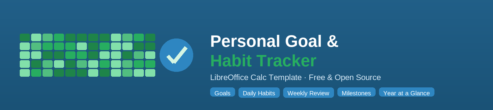
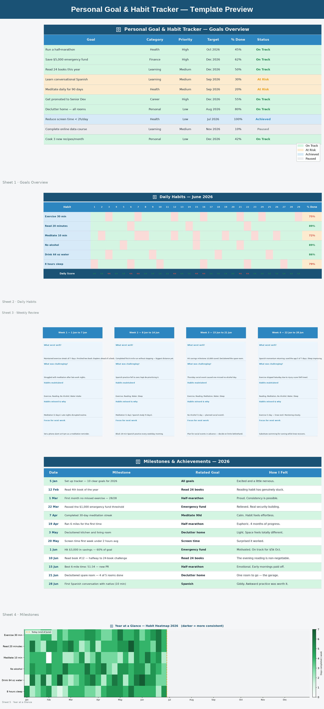
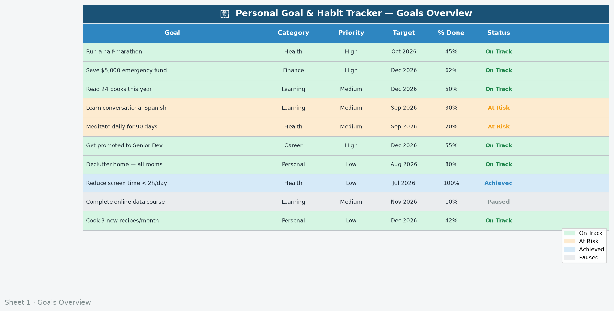
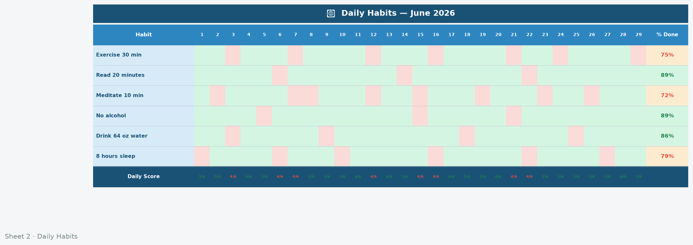
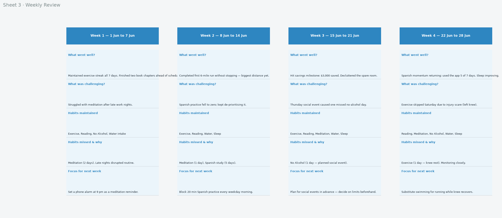
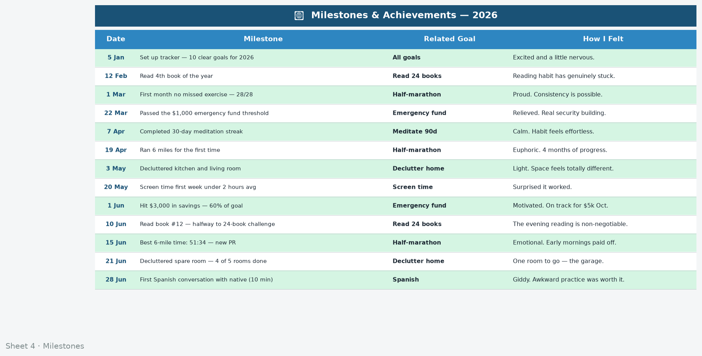
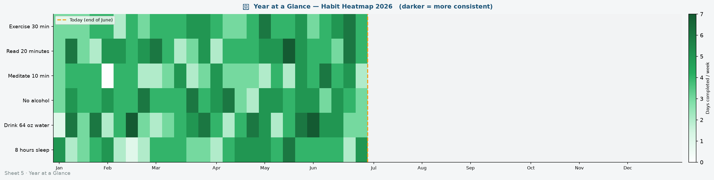

# Personal Goal & Habit Tracker

A free, ready-to-use LibreOffice Calc template for setting meaningful goals, tracking daily habits, running weekly reviews, and visualising a full year of consistency at a glance. No macros, no complicated setup — open and start using.

---

## Preview



---

## Template

| File | Format | Sheets | Charts |
|------|--------|--------|--------|
| `personal-goal-habit-tracker/personal-goal-habit-tracker.ots` | LibreOffice Calc Template | 5 | 5 |

### Sheets

| # | Sheet | Purpose |
|---|-------|---------|
| 1 | **Goals Overview** | Up to 10 goals with category, priority, target date, and progress |
| 2 | **Daily Habits** | Monthly habit grid — rows are habits, columns are days |
| 3 | **Weekly Review** | Structured reflection prompts for each week |
| 4 | **Milestones** | Log of key achievements with dates and notes |
| 5 | **Year at a Glance** | Heatmap showing habit consistency across all 52 weeks |

---

## Getting Started

### Requirements
- [LibreOffice](https://www.libreoffice.org/download/download-libreoffice/) 7.0 or later (free and open source)
- Works on Windows, macOS, and Linux

### Using the Template
1. Download or clone this repository.
2. Open `personal-goal-habit-tracker/personal-goal-habit-tracker.ots` in LibreOffice Calc — it opens as a new untitled document, leaving the template intact.
3. Save immediately as `.ods` with a meaningful name (e.g. `habits-2026.ods`).
4. Fill in your goals in **Goals Overview**.
5. Add 3–7 habits to **Daily Habits** (the habit names in column A).
6. Each day, mark completed habits with `1`.
7. Every Sunday, spend 10 minutes on **Weekly Review**.
8. Log achievements in **Milestones** as they happen.
9. Check **Year at a Glance** monthly to spot patterns.

---

## Screenshots

| Sheet | Preview |
|-------|---------|
| Goals Overview |  |
| Daily Habits |  |
| Weekly Review |  |
| Milestones |  |
| Year at a Glance |  |

---

## Design Conventions

| Style | Meaning |
|-------|---------|
| Light blue cell | Input cell — enter your data here |
| White cell | Formula cell — do not overwrite |
| Green background | Completed / On Track / positive result |
| Red background | Missed / At Risk / over budget |
| Amber background | Warning — review needed |
| Dropdown arrow | Cell has a predefined list of valid options |

---

## Rebuilding the Template

The template and all images are generated by two Python scripts. To regenerate them:

```bash
pip install -r requirements.txt
python3 build_template.py   # creates the .ots and .xlsx files
python3 build_images.py     # creates the logo, banner, and screenshots
```

### Scripts

| Script | Output |
|--------|--------|
| `build_template.py` | `personal-goal-habit-tracker.ots` + `.xlsx` with sample data and embedded charts |
| `build_images.py` | Logo icon (512 px, 256 px), banner (1600×360), five sheet screenshots, composite preview |

---

## Repository Structure

```
calc_personal_goal_habit_tracker/
│
├── README.md
├── requirements.txt
├── build_template.py
├── build_images.py
│
└── personal-goal-habit-tracker/
    ├── README.md
    ├── personal-goal-habit-tracker.ots   ← use this
    ├── personal-goal-habit-tracker.xlsx  ← source used for conversion
    └── images/
        ├── logo-icon.png
        ├── logo-icon-256.png
        ├── logo-banner.png
        ├── preview-all-sheets.png
        ├── screenshot-01-goals-overview.png
        ├── screenshot-02-daily-habits.png
        ├── screenshot-03-weekly-review.png
        ├── screenshot-04-milestones.png
        └── screenshot-05-year-at-a-glance.png
```

---

## Licence

Released under the [MIT Licence](./LICENSE). Free to use, modify, and distribute for personal or commercial purposes. Attribution appreciated but not required.

---

*Built with [LibreOffice Calc](https://www.libreoffice.org/) — free, open-source, and available on every platform.*
